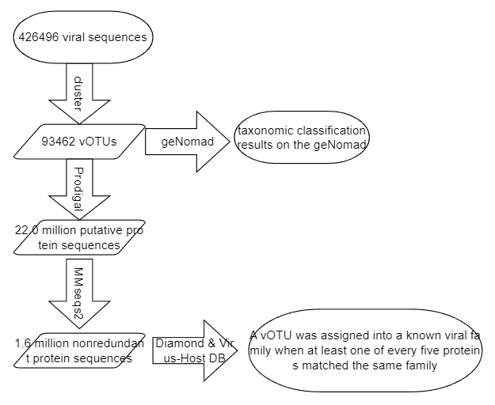
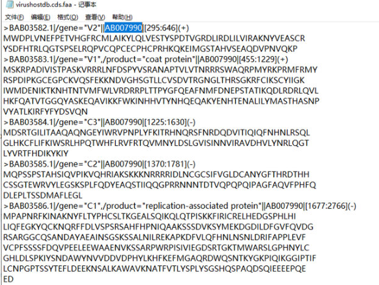
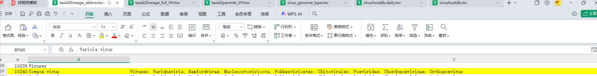

用自己的数据，复现参考文献的流程

参考文献：[*2025-The Chinese gut virus catalogue reveals gut virome diversity and disease-related viral signatures*](https://pmc.ncbi.nlm.nih.gov/articles/PMC11938785/)

#### **Viral clustering and gene prediction**

Following the clustering methodology described in our previous studies [[36](https://pmc.ncbi.nlm.nih.gov/articles/PMC11938785/#CR36), [38](https://pmc.ncbi.nlm.nih.gov/articles/PMC11938785/#CR38)], we clustered viral sequences at a 95% average nucleotide similarity threshold (≥ 85% coverage), resulting in a nonredundant gut virus catalogue consisting of 93,462 viral operational taxonomic units (vOTUs). For each vOTUs, the longest viral sequence was selected as the representative virus. Approximately 22.0 million putative protein sequences across all vOTUs were predicted via Prodigal (v2.6.3) [[45](https://pmc.ncbi.nlm.nih.gov/articles/PMC11938785/#CR45)] with the parameter “-p meta,” and these sequences were clustered into nearly 1.6 million nonredundant protein sequences using MMseqs2 (v12.113e3) in *easy-linclust* mode [[46](https://pmc.ncbi.nlm.nih.gov/articles/PMC11938785/#CR46)] with the parameters “–min-seq-id 0.9 –cov-mode 1 -c 0.8 –kmer-per-seq 80.”

#### **Taxonomic classification, host assignment, and functional annotation**

Taxonomic classification of vOTUs was performed using Diamond (v2.0.13.151) [[47](https://pmc.ncbi.nlm.nih.gov/articles/PMC11938785/#CR47)] with parameters “–id 30 –query-cover 50 –min-score 50 –max-target-seqs 10.” Protein sequences were aligned against an integrated viral protein database derived from [Virus-Host DB](https://www.genome.jp/ftp/db/virushostdb/) [[48](https://pmc.ncbi.nlm.nih.gov/articles/PMC11938785/#CR48)] (downloaded in November 2024). A vOTU was assigned into a known viral family when at least one of every five proteins matched the same family. Additionally, we also provided taxonomic classification results of all vOTUs based on the geNomad database [[49](https://pmc.ncbi.nlm.nih.gov/articles/PMC11938785/#CR49)], as shown in Additional file 2: Table S4.

#### 流程图



##### Virus-Host DB数据库处理

下载http://genome.jp/ftp/db/virushostdb/old/release225/ (downloaded in November 2024)

###### **数据库文件解释：**



`virushostdb.cds.faa`FASTA 格式的病毒编码区蛋白序列，蓝色部分对应`virushostdb.tsv`的`refseq`列

- `BAB03582.1`：这是序列在数据库中的登录号 (Accession Number) 是唯一的登录号，用于在数据库中精准定位这条序列。
- `V2`：这是该序列所编码的特定蛋白质或基因的名称/标识符。
- `AB007990`：对应参考序列的登录号，**该登录号对应唯一的分类学谱系（Lineage）**。

---


> BAB03582.1 Eupatorium yellow vein virus|V2|Eupatorium|Viruses; Geminiviridae; Begomovirus|Eukaryota; Viridiplantae; Streptophyta; Streptophytina; Magnoliopsida; Asterales; Asteraceae; Asteroideae; Eupatorieae|AB007990|| MWDPLVNEFPETVHGFRCMLAIKYLQLVESTYSPDTVGRDLIRDLILVIRAKNYVEASCR YSDFHTRLQGTSPSELRQPVCQPCECPHCPRHKQKEIMGSTAHVSEAQDVPNVQKP

`virushostdb.formatted.cds.faa`FASTA 格式的病毒编码区蛋白序列，格式化描述行，多了对应的病毒分类信息和宿主分类信息。

- `Eupatorium yellow vein virus`：这是序列来源的生物体名称。这种病毒的中文名称是“泽兰黄脉病毒”，它感染泽兰属（*Eupatorium*）植物，引起叶片黄脉症状。

- `Eupatorium`：宿主，该病毒是从泽兰属（*Eupatorium*）植物中分离得到的。

- `Viruses; Geminiviridae; Begomovirus`：病毒的分类学谱系（Lineage）。

- - 域/界 (Domain/Kingdom): `Viruses` (病毒界)
  - 科 (Family): `Geminiviridae` (双生病毒科)
  - 属 (Genus): `Begomovirus` (菜豆金色花叶病毒属)

- `Eukaryota; Viridiplantae; Streptophyta; Streptophytina; Magnoliopsida; Asterales; Asteraceae; Asteroideae; Eupatorieae`：宿主（泽兰属植物）的分类学谱系（Lineage）。

- - 域 (Domain): `Eukaryota` (真核生物域)
  - 界 (Kingdom): `Viridiplantae` (绿色植物界)
  - 门 (Phylum): `Streptophyta` (链型植物门)
  - 亚门 (Subphylum): `Streptophytina` (链型植物亚门)
  - 纲 (Class): `Magnoliopsida` (木兰纲 - 通常指双子叶植物)
  - 目 (Order): `Asterales` (菊目)
  - 科 (Family): `Asteraceae` (菊科)
  - 亚科 (Subfamily): `Asteroideae` (菊亚科)
  - 族 (Tribe): `Eupatorieae` (泽兰族)

---




`taxid2lineage_abbreviated_VH.tsv`各列依次为：每个分类单元的ID，最终的分类，各上级分类等级【行数为宿主+病毒，目前不知道有什么作用】

------


`taxid2lineage_full_VH.tsv`各列依次为：每个分类单元的ID，最终的分类，各上级分类等级（有时会有比`abbreviated`文件更细一些的等级）【行数为宿主+病毒，目前不知道有什么作用】

------


`taxid2parents_VH.tsv`每个分类单元的直接上级分类列表【行数为宿主+病毒，目前不知道有什么作用】

------


`virus_genome_type.tsv`每个分类单元`virus tax id`按列分隔的分类等级【行数为virus tax id的个数】

------


`virushostdb.tsv`可根据`refseq`列找到蛋白对应的病毒序列【行数为不同的virus tax id与refseq id组合的个数】

------


`virushostdb.daily.tsv`按理说应该是`virushostdb.tsv`的本次更新的内容 。

------


###### **处理数据库文件，使其能够根据比对到的faa序列找到分类信息表中对应的分类：**

需要文件`virus_genome_type.tsv`和`virushostdb.tsv`

**处理virushostdb.tsv**

```shell
# 提取1~4列,去除重复列，sort -r 倒序
cut -f 1,2,3,4 virushostdb.tsv | sort -r | uniq > virushostdb_nonredundant.tsv
# 33586 → 28964

# 计算有多少个不同的virus tax id 
cut -f 1 virushostdb.tsv | sort -r | uniq | wc -l 
# 28798
```

| virus tax id | virus name                | virus lineage                                                | refseq id                                                    |
| ------------ | ------------------------- | ------------------------------------------------------------ | :----------------------------------------------------------- |
| 10497        | African swine fever virus | Viruses; Varidnaviria; Bamfordvirae; Nucleocytoviricota; Pokkesviricetes; Asfuvirales; Asfarviridae; Asfivirus | NC_044950, NC_044951, NC_044952, NC_044953, NC_044954        |
| 10497        | African swine fever virus | Viruses; Varidnaviria; Bamfordvirae; Nucleocytoviricota; Pokkesviricetes; Asfuvirales; Asfarviridae; Asfivirus | NC_044949                                                    |
| 10497        | African swine fever virus | Viruses; Varidnaviria; Bamfordvirae; Nucleocytoviricota; Pokkesviricetes; Asfuvirales; Asfarviridae; Asfivirus | NC_044947, NC_044948                                         |
| 10497        | African swine fever virus | Viruses; Varidnaviria; Bamfordvirae; Nucleocytoviricota; Pokkesviricetes; Asfuvirales; Asfarviridae; Asfivirus | NC_001659, NC_044942                                         |
| 10497        | African swine fever virus | Viruses; Varidnaviria; Bamfordvirae; Nucleocytoviricota; Pokkesviricetes; Asfuvirales; Asfarviridae; Asfivirus | NC_001659, NC_044941, NC_044942, NC_044943, NC_044944, NC_044945, NC_044946, NC_044947, NC_044948, NC_044955, NC_044959 |

观察`virushostdb_nonredundant.tsv`，发现同一个`refseq id`，即便它在不同的行，它所对应的`virus tax id`都是相同的。而`virus tax id`相同的，`virus lineage`必定相同，所以可以根据`refseq id`来确定faa文件中对应蛋白的分类，例如蛋白序列 BAB03586.1|/gene="C1",/product="replication-associated protein"||`AB007990`|1677:2766 对应的分类注释可由`AB007990`决定。

所以根据`virushostdb_nonredundant.tsv`可以作为主表，根据匹配`virus tax id`添加`virus_genome_type.tsv`各列

（==计算有多少个不同的virus tax id `cut -f 1 virushostdb.tsv | sort -r | uniq | wc -l` 输出28798，刚好是`virus_genome_type.tsv`的行数（差了标题行）==）

**处理 virus_genome_type.tsv**

```shell
# 重新排序分类等级
awk -F'\t' -v OFS='\t' '{print $1, $4, $18, $15, $5, $7, $8, $10, $11, $12}' virus_genome_type.tsv > tmp
# 28797
```

**匹配 virus tax id，将tmp的各分类等级添加到virushostdb_nonredundant.ts中**

```shell
# 步骤1: 提取标题行并排序数据
head -n1 virushostdb_nonredundant.tsv > header1
tail -n +2 virushostdb_nonredundant.tsv | sort -k1,1 > sorted1

head -n1 tmp > header2
tail -n +2 tmp | sort -k1,1 > sorted2

# 步骤2: 合并标题行
cut -f2- header2 | paste header1 - > final_header

# 步骤3: 执行join操作（按第一列匹配）
join -t $'\t' -1 1 -2 1 -a 1 sorted1 sorted2 > joined_data

# 步骤4: 组合结果
cat final_header joined_data > final_tax.tsv

# 清理临时文件
rm header1 sorted1 header2 sorted2 final_header joined_data
```

**根据final_tax.tsv获取refseq id与family的映射**

```shell
# 对于refseq id列的值，有单个元素的，也有多个元素的（以逗号隔开），我想按单个元素取出所有不同的refseq id作为一列，然后匹配对应的family列和作为第二列，得到新文件。例如某一行的refseq id：NC_016757, NC_016758, NC_016759, NC_016760，对应行的family为Quadriviridae，那么处理这行就能为新文件添加四行。
awk 'BEGIN {FS=OFS="\t"} NR>1 {split($4, refseqs, ","); for(i in refseqs) {gsub(/^[ 	]+|[ 	]+$/, "", refseqs[i]); print refseqs[i], $11, $3}}' final_tax.tsv > refseq_family.tsv

# family列为空的，用Unclassified填充，去重
awk 'BEGIN {FS=OFS="\t"} {if($2 == "") $2="Unclassified"} 1' refseq_family.tsv | sort | uniq > tmp && mv tmp refseq_family.tsv

# 创建标记文件，标记数据库已处理
touch virushostdb_configured
```

最终得到的`refseq_family.tsv`就是整理好的分类信息文件


##### 流程步骤

- **cluster**：we clustered viral sequences at a 95% average nucleotide similarity threshold (≥ 85% coverage)
- **Prodigal**：(v2.6.3)  with the parameter `-p meta`
- **MMseqs2**: (v12.113e3) in `easy-linclust`` mode` with the parameters `–min-seq-id 0.9 –cov-mode 1 -c 0.8 –kmer-per-seq 80`
- **Diamond**： (v2.0.13.151) with parameters `–id 30 –query-cover 50 –min-score 50 –max-target-seqs 10`
- **Virus-Host DB**： (downloaded in November 2024)
- **geNomad**：we also provided taxonomic classification results of all vOTUs based on the geNomad database

#### 复现流程代码

`snakemake -s pipeline.smk --cores 5 --use-conda`

#### 输出示例

| votu_id                  | family       | lineage_diamond                                              | lineage_genomad                                              |
| ------------------------ | ------------ | ------------------------------------------------------------ | ------------------------------------------------------------ |
| F1_1A_contig_100\|\|full | Unclassified | Viruses; Duplodnaviria; Heunggongvirae; Uroviricota; Caudoviricetes; unclassified Caudoviricetes | Viruses; Duplodnaviria; Heunggongvirae; Uroviricota; Caudoviricetes;; |


