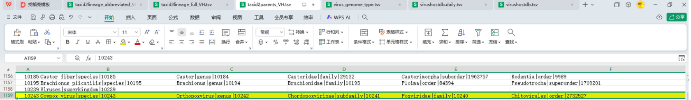
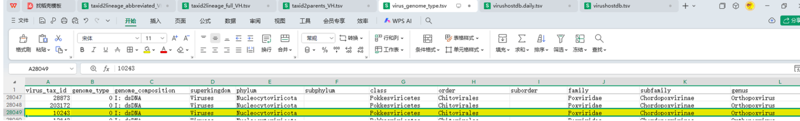
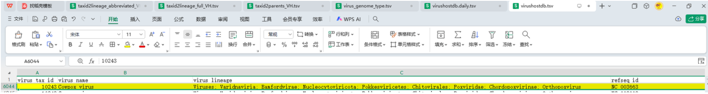
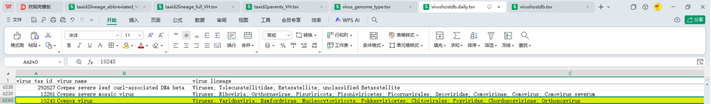
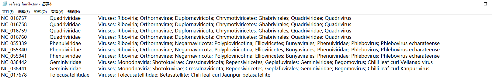

用自己的数据，复现参考文献的流程

参考文献：[*2025-The Chinese gut virus catalogue reveals gut virome diversity and disease-related viral signatures*](https://pmc.ncbi.nlm.nih.gov/articles/PMC11938785/)


#### **Viral clustering and gene prediction**

Following the **clustering methodology** described in our previous studies [[36](https://pmc.ncbi.nlm.nih.gov/articles/PMC11938785/#CR36), [38](https://pmc.ncbi.nlm.nih.gov/articles/PMC11938785/#CR38)], **we clustered viral sequences at a 95% average nucleotide similarity threshold (≥ 85% coverage), resulting in a nonredundant gut virus catalogue consisting of 93,462 viral operational taxonomic units (vOTUs).** **For each vOTUs, the longest viral sequence was selected as the representative virus.** Approximately 22.0 million putative protein sequences across all vOTUs were predicted via **Prodigal (v2.6.3) [**[**45**](https://pmc.ncbi.nlm.nih.gov/articles/PMC11938785/#CR45)**] with the parameter “-p meta**,” and these sequences were clustered into nearly 1.6 million **nonredundant protein sequences** using MMseqs2 (v12.113e3) in *easy-linclust* mode [[46](https://pmc.ncbi.nlm.nih.gov/articles/PMC11938785/#CR46)] with the parameters “–min-seq-id 0.9 –cov-mode 1 -c 0.8 –kmer-per-seq 80.”

#### **Taxonomic classification, host assignment, and functional annotation**

Taxonomic classification of vOTUs was performed using Diamond (v2.0.13.151) [[47](https://pmc.ncbi.nlm.nih.gov/articles/PMC11938785/#CR47)] with parameters “–id 30 –query-cover 50 –min-score 50 –max-target-seqs 10.” Protein sequences were aligned against an integrated viral protein database derived from [Virus-Host DB](https://www.genome.jp/ftp/db/virushostdb/) [[48](https://pmc.ncbi.nlm.nih.gov/articles/PMC11938785/#CR48)] (downloaded in November 2024). **A vOTU was assigned into a known viral family** when **at least** **one of every five proteins** **matched the same family**. Additionally, we also provided taxonomic classification results of **all vOTUs based on the geNomad database** [[49](https://pmc.ncbi.nlm.nih.gov/articles/PMC11938785/#CR49)], as shown in Additional file 2: Table S4.

#### 流程图


##### Virus-Host DB数据库处理

下载http://genome.jp/ftp/db/virushostdb/old/release225/ (downloaded in November 2024)

###### **数据库文件解释：**


`virushostdb.cds.faa`FASTA 格式的病毒编码区蛋白序列，蓝色部分对应`virushostdb.tsv`的`refseq`列

---


`taxid2lineage_abbreviated_VH.tsv`各列依次为：每个分类单元的ID，最终的分类，各上级分类等级【行数为宿主+病毒，目前不知道有什么作用】

------


`taxid2lineage_full_VH.tsv`各列依次为：每个分类单元的ID，最终的分类，各上级分类等级（有时会有比`abbreviated`文件更细一些的等级）【行数为宿主+病毒，目前不知道有什么作用】

------




`taxid2parents_VH.tsv`每个分类单元的直接上级分类列表【行数为宿主+病毒，目前不知道有什么作用】

------




`virus_genome_type.tsv`每个分类单元`virus tax id`按列分隔的分类等级【行数为virus tax id的个数】

------




`virushostdb.tsv`可根据`refseq`列找到蛋白对应的病毒序列【行数为不同的virus tax id与refseq id组合的个数】

------




`virushostdb.daily.tsv`按理说应该是`virushostdb.tsv`的本次更新的内容 。

------


###### **处理数据库文件，使其能够根据比对到的faa序列找到分类信息表中对应的分类：**

需要文件`virus_genome_type.tsv`和`virushostdb.tsv`

**处理virushostdb.tsv**

```shell
# 提取1~4列,去除重复列，sort -r 倒序
cut -f 1,2,3,4 virushostdb.tsv | sort -r | uniq > virushostdb_nonredundant.tsv
# 33586 → 28964

# 计算有多少个不同的virus tax id 
cut -f 1 virushostdb.tsv | sort -r | uniq | wc -l 
# 28798
```

| virus tax id | virus name                | virus lineage                                                | refseq id                                                    |
| ------------ | ------------------------- | ------------------------------------------------------------ | :----------------------------------------------------------- |
| 10497        | African swine fever virus | Viruses; Varidnaviria; Bamfordvirae; Nucleocytoviricota; Pokkesviricetes; Asfuvirales; Asfarviridae; Asfivirus | NC_044950, NC_044951, NC_044952, NC_044953, NC_044954        |
| 10497        | African swine fever virus | Viruses; Varidnaviria; Bamfordvirae; Nucleocytoviricota; Pokkesviricetes; Asfuvirales; Asfarviridae; Asfivirus | NC_044949                                                    |
| 10497        | African swine fever virus | Viruses; Varidnaviria; Bamfordvirae; Nucleocytoviricota; Pokkesviricetes; Asfuvirales; Asfarviridae; Asfivirus | NC_044947, NC_044948                                         |
| 10497        | African swine fever virus | Viruses; Varidnaviria; Bamfordvirae; Nucleocytoviricota; Pokkesviricetes; Asfuvirales; Asfarviridae; Asfivirus | NC_001659, NC_044942                                         |
| 10497        | African swine fever virus | Viruses; Varidnaviria; Bamfordvirae; Nucleocytoviricota; Pokkesviricetes; Asfuvirales; Asfarviridae; Asfivirus | NC_001659, NC_044941, NC_044942, NC_044943, NC_044944, NC_044945, NC_044946, NC_044947, NC_044948, NC_044955, NC_044959 |

观察`virushostdb_nonredundant.tsv`，发现同一个`refseq id`，即便它在不同的行，它所对应的`virus tax id`都是相同的。而`virus tax id`相同的，`virus lineage`必定相同，所以可以根据`refseq id`来确定faa文件中对应蛋白的分类，例如蛋白序列 BAB03586.1|/gene="C1",/product="replication-associated protein"||`AB007990`|1677:2766 对应的分类注释可由`AB007990`决定。

所以根据`virushostdb_nonredundant.tsv`可以作为主表，根据匹配`virus tax id`添加`virus_genome_type.tsv`各列

（==计算有多少个不同的virus tax id `cut -f 1 virushostdb.tsv | sort -r | uniq | wc -l` 输出28798，刚好是`virus_genome_type.tsv`的行数（差了标题行）==）

**处理 virus_genome_type.tsv**

```shell
# 重新排序分类等级
awk -F'\t' -v OFS='\t' '{print $1, $4, $18, $15, $5, $7, $8, $10, $11, $12}' virus_genome_type.tsv > tmp
# 28797
```

**匹配 virus tax id，将tmp的各分类等级添加到virushostdb_nonredundant.ts中**

```shell
# 步骤1: 提取标题行并排序数据
head -n1 virushostdb_nonredundant.tsv > header1
tail -n +2 virushostdb_nonredundant.tsv | sort -k1,1 > sorted1

head -n1 tmp > header2
tail -n +2 tmp | sort -k1,1 > sorted2

# 步骤2: 合并标题行
cut -f2- header2 | paste header1 - > final_header

# 步骤3: 执行join操作（按第一列匹配）
join -t $'\t' -1 1 -2 1 -a 1 sorted1 sorted2 > joined_data

# 步骤4: 组合结果
cat final_header joined_data > final_tax.tsv

# 清理临时文件
rm header1 sorted1 header2 sorted2 final_header joined_data
```

**根据final_tax.tsv获取refseq id与family的映射**

```shell
# 对于refseq id列的值，有单个元素的，也有多个元素的（以逗号隔开），我想按单个元素取出所有不同的refseq id作为一列，然后匹配对应的family列和作为第二列，得到新文件。例如某一行的refseq id：NC_016757, NC_016758, NC_016759, NC_016760，对应行的family为Quadriviridae，那么处理这行就能为新文件添加四行。
awk 'BEGIN {FS=OFS="\t"} NR>1 {split($4, refseqs, ","); for(i in refseqs) {gsub(/^[ 	]+|[ 	]+$/, "", refseqs[i]); print refseqs[i], $11, $3}}' final_tax.tsv > refseq_family.tsv

# family列为空的，用Unclassified填充
awk 'BEGIN {FS=OFS="\t"} {if($2 == "") $2="Unclassified"} 1' refseq_family.tsv > tmp && mv tmp refseq_family.tsv

# 去重
awk 'BEGIN {FS=OFS="\t"} {if($2 == "") $2="Unclassified"} 1' refseq_family.tsv | sort | uniq > tmp && mv tmp refseq_family.tsv
```

最终得到的`refseq_family.tsv`就是整理好的分类信息文件



#### 复现流程代码

`snakemake -s pipeline.smk --cores 5 --use-conda`

``` python
# snakemake -s pipeline.smk --cores 5 --use-conda
##### 待改进部分：
# ① 是否需要选择最佳匹配？但是原文中设置了diamond --max-target-seqs 10,所以不需要选择最佳匹配?
# ② 事实上，如果选择最佳匹配，不必自定义一个函数，只需 --max-target-seqs 1 即可

import os
import pandas as pd
##################################### 定义函数
# 选择最佳匹配
def select_best_matches(input_file_path, output_path):
    """
    选出相同查询序列的最佳匹配,即bitscore（最后一列的值）最高的那一行
    参数:
        input_file_path: 输入TSV文件路径
        output_path: 输出TSV文件路径
    返回:
        bool: 处理是否成功
    """
    try:
        # 读取文件内容并按查询序列分组
        query_groups = {}
        with open(input_file_path, 'r', encoding='utf-8') as f_in:
            for line in f_in:
                columns = line.strip().split('\t')
                if not columns or len(columns) < 6:
                    continue
                
                query_id = columns[0]
                bitscore = float(columns[-1])  # 最后一列是bitscore
                
                # 如果是新的查询序列或当前行的bitscore更高，则更新
                if query_id not in query_groups or bitscore > query_groups[query_id]['bitscore']:
                    query_groups[query_id] = {
                        'bitscore': bitscore,
                        'line': line
                    }
        
        # 写入最佳匹配结果
        with open(output_path, 'w', encoding='utf-8') as f_out:
            for query_id in query_groups:
                f_out.write(query_groups[query_id]['line'])
        
        return True
    except Exception as e:
        print(f"处理文件时发生错误: {e}")
        return False

# 格式化diamond结果
def format_diamond_results(diamond_results_path, output_path):
    """
    验证diamond_results.tsv中每行第二列按"|"分隔后的元素个数是否一致,如果一致,则将第二列修改为倒数第二个元素
    去掉diamond_results.tsv第一列中的最后一个_及之后的部分,得到蛋白对应的病毒ID
    输出新的TSV文件

    
    参数:
        diamond_results_path: diamond_results.tsv文件路径
        output_path: 输出文件路径,如果为None则不输出
    返回:
        bool: 如果所有行的第二列元素个数一致,则返回True,否则返回False
    """
    # 读取文件内容
    with open(diamond_results_path, 'r') as file:
        lines = file.readlines()

    first_line = True       # 标记是否为文件的第一行
    expected_count = None   # 一行第二列分割后的元素数量
    is_valid = True         # 标记是否所有行都有效
    modified_lines = []     # 存储修改后的行

    for line_num, line in enumerate(lines, 1):
    # - enumerate(lines, 1) : 内置函数，用于将可迭代对象 lines 转换为索引-元素对
    # - 第一个参数 lines ：要遍历的列表（这里是文件的所有行）
    # - 第二个参数 1 ：指定索引的起始值为1（默认是0）
    # - line_num : 变量名，存储当前元素的索引（行号）
    # - line : 变量名，存储当前遍历到的 lines 中的元素（文件行内容）
        
        columns = line.strip().split('\t')  # 对每一行，先按制表符 \t 分割成多列
        
        # 处理第一列，去掉最后一个_及之后的部分
        if columns:
            first_column = columns[0]
            last_underscore_index = first_column.rfind('_')
            if last_underscore_index != -1:
                columns[0] = first_column[:last_underscore_index]
        
        # 处理第二列，按"|"分隔
        second_column = columns[1]
        elements = second_column.split('|')
        
        # 先计算第一行第二列按“|”分隔后的元素个数
        if first_line:
            expected_count = len(elements)
            first_line = False
            # 对于第一行，修改第二列为倒数第二个元素
            if expected_count > 1:
                columns[1] = elements[-2]  # 取倒数第二个元素
            modified_line = '\t'.join(columns) + '\n'
            modified_lines.append(modified_line)
        # 后续行，检查元素个数是否与第一行相同
        else:   
            if len(elements) != expected_count:
                print(f"第{line_num}行: 第二列按'|'分隔后的元素个数与第一行不同")
                is_valid = False
                modified_lines.append(line)  # 添加原行
            else:
                # 元素个数一致，修改第二列为倒数第二个元素
                if len(elements) > 1:
                    columns[1] = elements[-2]  # 取倒数第二个元素
                modified_line = '\t'.join(columns) + '\n'
                modified_lines.append(modified_line)
    
    # 输出新文件（如果所有行都有效）
    if is_valid:
        try:
            with open(output_path, 'w', encoding='utf-8') as f:
                f.writelines(modified_lines)
        except Exception as e:
            print(f"写入文件时发生错误: {e}")
            is_valid = False
    
    return is_valid

# 合并diamond结果和refseq分类信息
def merge_diamond_refseq(refseq_family_path, diamond_results_processed_path, output_path = 'merge_diamond_refseq.tsv'):
    """
    根据预处理后的diamond结果表的第二列匹配refseq id 对应的分类信息表的对应行,（匹配不到则报错）
    将refseq id 对应的分类信息表的第2、3列添加到预处理后的diamond结果表中。

    参数:
        refseq_family_path: refseq id 对应的分类信息表
        diamond_results_processed_path: 预处理后的diamond结果表
        output_path: 输出文件的路径
    """
    # 读取文件refseq_family_path，创建ID到family和分类信息的映射
    refseq_family_map = {}
    try:
        with open(refseq_family_path, 'r', encoding='utf-8') as f2:
            for line in f2:
                columns = line.strip().split('\t')
                # 文件2的第一列作为键，第二列和第三列作为值
                refseq_family_map[columns[0]] = (columns[1], columns[2])
    except Exception as e:
        print(f"读取文件{refseq_family_path}时发生错误: {e}")
        return False

    # 处理文件diamond_results_processed_path并写入结果
    try:
        with open(diamond_results_processed_path, 'r', encoding='utf-8') as f1, \
                open(output_path, 'w', encoding='utf-8') as out:
            for line in f1:
                columns = line.strip().split('\t')

                # 获取文件1第二列的值用于匹配
                id_to_match = columns[1]
                # 查找匹配项
                if id_to_match in refseq_family_map:
                    family, lineage = refseq_family_map[id_to_match]
                    # 添加文件2的第2、3列
                    columns.extend([family, lineage])
                else:
                    # 如果没有匹配项，抛出错误
                    raise ValueError(f"在{refseq_family_path}中未找到与{diamond_results_processed_path}中ID '{id_to_match}' 匹配的refseq id")

                # 写入结果
                out.write('\t'.join(columns) + '\n')
    except Exception as e:
        print(f"处理文件{diamond_results_processed_path}或写入输出文件时发生错误: {e}")
        return False

    return True

# 分配科分类和完整分类
def assign_family_classification(merged_file_path, output_path):
    """
    对于同一个查询序列的所有匹配，如果有至少20%匹配的科水平的分类信息相同，
    那么该查询序列的科级分类就是这个匹配的科级分类。
    对于未满足20%频率条件的查询序列，科级分类标记为Unclassified，
    但完整分类等级设置为频率最高的科首次匹配的完整分类。
    输出一个新的表格，第一列是查询序列，第二列是科，第三列是科对应的所有分类等级（原表格的最后一列）

    参数:
        merged_file_path: 输入TSV文件路径
        output_path: 输出TSV文件路径
    返回:
        bool: 处理是否成功
    """
    try:
        # 读取文件内容并按查询序列分组
        query_groups = {}
        with open(merged_file_path, 'r', encoding='utf-8') as f_in:
            for line in f_in:
                columns = line.strip().split('\t')
                if not columns or len(columns) < 8:
                    continue
                
                query_id = columns[0]
                family = columns[6]
                lineage = columns[7]
                
                if query_id not in query_groups:
                    query_groups[query_id] = []
                
                query_groups[query_id].append({
                    'family': family,
                    'lineage': lineage
                })
        
        # 处理每个查询序列，确定科级分类
        results = []
        for query_id, matches in query_groups.items():
            total_matches = len(matches)
            family_count = {}
            
            # 统计每个科出现的次数
            for match in matches:
                family = match['family']
                if family not in family_count:
                    family_count[family] = 0
                family_count[family] += 1
            
            # 找到频率最高的科及其首次匹配的完整分类
            max_count = 0
            most_frequent_family = 'Unclassified'
            most_frequent_lineage = 'Viruses; unclassified viruses'
            
            for family, count in family_count.items():
                if count > max_count:
                    max_count = count
                    most_frequent_family = family
                    # 获取该科首次出现的完整分类
                    for match in matches:
                        if match['family'] == family:
                            most_frequent_lineage = match['lineage']
                            break
            
            # 检查是否有科出现频率超过20%
            assigned_family = 'Unclassified'
            assigned_lineage = most_frequent_lineage  # 默认使用频率最高的科的分类等级
            
            for family, count in family_count.items():
                frequency = count / total_matches
                if frequency >= 0.2:
                    assigned_family = family
                    # 获取该科对应的分类等级
                    for match in matches:
                        if match['family'] == family:
                            assigned_lineage = match['lineage']
                            break
                    break
            
            results.append({
                'query_id': query_id,
                'family': assigned_family,
                'lineage': assigned_lineage
            })
        
        # 写入结果
        with open(output_path, 'w', encoding='utf-8') as f_out:
            # 写入表头
            f_out.write('QueryID\tfamily\tlineage\n')
            # 写入数据行
            for result in results:
                f_out.write(f"{result['query_id']}\t{result['family']}\t{result['lineage']}\n")
        
        return True
    except Exception as e:
        print(f"处理文件时发生错误: {e}")
        return False

##################################### 定义全局变量
# 样本名
SAMPLES = [
    "F1_1A", "F1_2A", "F1_3A",
    "F2_1A", "F2_2A", "F2_3A",
    "FG_1A", "FG_2A", "FG_3A",
    "L1_1A", "L1_2A", "L1_3A",
    "L2_1A", "L2_2A", "L2_3A",
    "H_LX", "H_O"
]

# uvigs的父目录，要求文件名的格式为sample_uvigs.fa
virus_dir = "/home/shijiabin/2025_2ME/03_virus_identification/03_pipeline2-2/07_all_sample_results"

# 参考数据库的路径
genomad_db_path = "/home/shijiabin/db/genomad_db"
virushostdb_path = "virushostdb_release225/virushostdb"
refseq_family_path = "virushostdb_release225/refseq_family.tsv"

# 输出日志文件(汇总注释的序列数量)
log_path = "output.log"

# 线程数
#threads = 20

##################################### 定义流程规则
# 创建日志目录
onstart:
    #shell("echo '单个任务使用的线程数: {threads}'")
    # 删除旧的日志文件
    shell("rm -f {log_path}")

# 最终要生成的文件
rule all:
    input:
        expand("06_merged_classification/{sample}.tsv", sample=SAMPLES)

# 聚类
rule cluster:
    input:
        virus = lambda wildcards: os.path.join(virus_dir, f"{wildcards.sample}_uvigs.fa")
    output:
        dir = directory("01_cluster/{sample}"),
        votus = "01_cluster/{sample}/votus.fa"
    log:
        "log/cluster/{sample}.log"
    shell:
        "cluster.sh -i {input.virus} -t {input.virus} -a 95 -o {output.dir} > {log} 2>&1"

# genomad分类注释
rule genomad:
    input:
        votus = "01_cluster/{sample}/votus.fa"
    output:
        dir = directory("02-1_genomad/{sample}"),
        genomad_tax = "02-1_genomad/{sample}/votus_annotate/votus_taxonomy.tsv"
    conda:
        "genomad"
    log:
        "log/genomad/{sample}.log"
    shell:
        # 仅运行分类注释
        "genomad annotate {input.votus} {output.dir} {genomad_db_path} > {log} 2>&1"

# votus预测蛋白
rule prodigal:
    input:
        votus = "01_cluster/{sample}/votus.fa"
    output:
        protein = "02_prodigal/{sample}_protein.faa"
    log:
        "log/prodigal/{sample}.log"
    shell:
        "prodigal -i {input.votus} -a {output.protein} -p meta > {log} 2>&1"

# 蛋白去冗余
rule mmseqs2:
    input:
        protein = "02_prodigal/{sample}_protein.faa"
    output:
        nonredundant_protein = "03_mmseqs2/{sample}_nonredundant_protein.faa"
    log:
        "log/mmseqs2/{sample}.log"
    shell:
        """
        mmseqs easy-linclust {input.protein} {wildcards.sample} {wildcards.sample}_tmp --min-seq-id 0.9 --cov-mode 1 -c 0.8 --kmer-per-seq 80 > {log} 2>&1
        mv {wildcards.sample}_rep_seq.fasta {output.nonredundant_protein}
        rm {wildcards.sample}_cluster.tsv {wildcards.sample}_all_seqs.fasta
        rm -r {wildcards.sample}_tmp
        """

# 非冗余蛋白比对到Virus-Host DB
rule diamond:
    input:
        nonredundant_protein = "03_mmseqs2/{sample}_nonredundant_protein.faa"
    output:
        diamond_results = "04_diamond/{sample}.tsv"
    log:
        "log/diamond/{sample}.log"
    shell:
        """
        diamond blastp \
            -q {input.nonredundant_protein} \
            -d {virushostdb_path} \
            --id 30 \
            --query-cover 50 \
            --min-score 50 \
            --max-target-seqs 10 \
            --outfmt 6 qseqid stitle pident length evalue bitscore \
            -o {output.diamond_results} > {log} 2>&1
        """

# 基于diamond结果分配科分类和完整分类
rule assign_classification:
    input:
        diamond_results = "04_diamond/{sample}.tsv"
    output:
        diamond_best_match = "05_diamond_classification/{sample}/01_best_match.tsv",
        diamond_format = "05_diamond_classification/{sample}/02_format.tsv",
        merge_diamond_refseq = "05_diamond_classification/{sample}/03_merge.tsv",
        diamond_classification = "05_diamond_classification/{sample}/04_classification.tsv"
    run:
        # 依次执行每个函数
        if not select_best_matches(input.diamond_results, output.diamond_best_match):
            raise Exception("select_best_matches failed")
        if not format_diamond_results(output.diamond_best_match, output.diamond_format):
            raise Exception("format_diamond_results failed")
        if not merge_diamond_refseq(refseq_family_path, output.diamond_format, output.merge_diamond_refseq):
            raise Exception("merge_diamond_refseq failed")
        if not assign_family_classification(output.merge_diamond_refseq, output.diamond_classification):
            raise Exception("assign_family_classification failed")

# 合并基于diamond的分类信息和基于genomad的分类信息
rule merge_classification:
    input:
        diamond_classification = "05_diamond_classification/{sample}/04_classification.tsv",
        genomad_tax = "02-1_genomad/{sample}/votus_annotate/votus_taxonomy.tsv"
    output:
        merged_classification = "06_merged_classification/{sample}.tsv"
    run:
        # 读取两个TSV文件（带表头）
        diamond_classification = pd.read_csv(input.diamond_classification, sep='\t', header=0)
        genomad_tax = pd.read_csv(input.genomad_tax, sep='\t', header=0)

        # 删除genomad_tax的n_genes_with_taxonomy列，agreement列，taxid列
        genomad_tax = genomad_tax.drop(columns=['n_genes_with_taxonomy', 'agreement', 'taxid'])

        # 重命名第一列的列名为votu_id，以便直接合并
        diamond_classification = diamond_classification.rename(columns={diamond_classification.columns[0]: 'votu_id'})
        genomad_tax = genomad_tax.rename(columns={genomad_tax.columns[0]: 'votu_id'})

        # 使用outer连接合并两个表格
        merged_classification = pd.merge(diamond_classification, genomad_tax, on='votu_id', how='outer', suffixes=('_diamond', '_genomad'))

        # 保存合并结果（保留表头）
        merged_classification.to_csv(output.merged_classification, sep='\t', index=False)

        # 写入信息到日志文件
        log_content = (
            f'{wildcards.sample} diamond 分类的序列数: {len(diamond_classification)}\n'
            f'{wildcards.sample} genomad 分类的序列数: {len(genomad_tax)}\n'
            f'{wildcards.sample} 合并后序列数: {len(merged_classification)}\n'
        )
        with open(log_path, "a") as f:
            f.write(log_content)

        # 保留控制台输出
        print(f'{wildcards.sample} 处理完毕')

onsuccess:
    # 输出合并数量统计信息
    shell(
        """
        # 重新排序日志文件
        sort {log_path} > tmp && mv tmp {log_path}
        echo "所有样本处理完毕！"
        echo "===================================="
        cat {log_path}
        """
    )

        


```

#### 输出示例

| votu_id                  | family       | lineage_diamond                                              | lineage_genomad                                              |
| ------------------------ | ------------ | ------------------------------------------------------------ | ------------------------------------------------------------ |
| F1_1A_contig_100\|\|full | Unclassified | Viruses; Duplodnaviria; Heunggongvirae; Uroviricota; Caudoviricetes; unclassified Caudoviricetes | Viruses; Duplodnaviria; Heunggongvirae; Uroviricota; Caudoviricetes;; |

