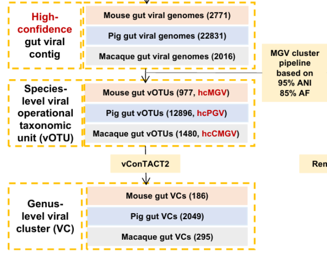

用自己的数据，复现参考文献的流程

参考文献：[*2025-Metagenomic analysis reveals gut phage diversity across three mammalian models*](https://pmc.ncbi.nlm.nih.gov/articles/PMC12180220/)

#### **Assembly and virus prediction**

The remaining 2771, 22,831, and 2016 high-confidence gut viral contigs was finally clustered into species-level viral operational taxonomic units (vOTUs) using criteria of 95% average nucleotide identity (ANI) and 85% alignment fraction (AF)  across the shorter sequence, as recommended by Roux et al. and demonstrated by Nayfach et al [[8](https://pmc.ncbi.nlm.nih.gov/articles/PMC12180220/#CR8)]. We obtained 977, 12,896, and 1480 high-confidence mouse, pig, and cynomolgus macaque gut vOTUs, referred to as hcMGV, hcPGV, and hcCMGV. The longest contig in each vOTU was hereafter designated as the centroid to represent the whole vOTU,*i.e.*, vOTU representative. The following analyses were mostly performed on hcMGV, hcPGV, and hcCMGV representatives.

#### **Taxonomic classification, lifestyle prediction, and host assignment**

**Virus taxonomy information from geNomad output was employed for the taxonomic assignment for the 977 hcMGV, 12,896 hcPGV, and 1480 hcCMGV representatives**. We used Prodigal [[30](https://pmc.ncbi.nlm.nih.gov/articles/PMC12180220/#CR30)] v2.6.2 (-p meta -m) to predict their open reading frames (ORFs) and then input the resulting amino acid sequences into vConTACT2 [[31](https://pmc.ncbi.nlm.nih.gov/articles/PMC12180220/#CR31)] v0.9.22 to generate gene-sharing networks (rel-mode'Diamond', db'None', pcs-mode MCL, vcs-mode ClusterONE, c1-bin cluster_one-1.0.jar).

#### 流程图

##### 流程步骤

- **cluster**：high-confidence gut viral contigs was finally clustered into species-level viral operational taxonomic units (vOTUs) using criteria of 95% average nucleotide identity (ANI) and 85% alignment fraction (AF) across the shorter sequence
- **geNomad**：Virus taxonomy information from geNomad output was employed for the taxonomic assignment for the 977 hcMGV, 12,896 hcPGV, and 1480 hcCMGV representatives
- `--lenient-taxonomy`允许将病毒基因组分类到科级以下的分类单元（亚科、属、亚属和种）。亚科和亚属级别只有在同时使用`--full-ictv-lineage`时才会显示。
- **Prodigal**：We used Prodigal v2.6.2 (`-p meta -m`) to predict their open reading frames (ORFs)
- **vConTACT2**：and then input the resulting amino acid sequences into vConTACT2 v0.9.22 to generate gene-sharing networks (`rel-mode'Diamond', db'None', pcs-mode MCL, vcs-mode ClusterONE, c1-bin cluster_one-1.0.jar`). The representative viral genomes were grouped into approximate genus-level viral clusters (VCs) based on the networks.
- **合并geNomad的分类信息和vConTACT2的genus-level viral clusters (VCs)：**
  - 关于vConTACT2的`genome_by_genome_overview.csv`的解释：VC Status的Clustered标记说明它与其他的病毒聚类到同一VC。同一 VC 子簇 (VC_22_1)，极大概率属于同一个属 (Genus)；同一 VC (VC_22) 但不同子簇，高度可能属于同一个亚科 (Subfamily) 或属级相关。
  - 将`genomad/votus_taxonomy`的分类谱系按等级拆分，然后合并到`genome_by_genome_overview`中，对合并后的表格：
    - 首先按VC编号分组，对每个VC组，进行如下处理：
      - 计算组内成员的Genus中非缺失值出现频数， 频数最高的成员，将它的各分类等级列的值赋值给其他Genus为缺失值的成员
      - 如果成员的Genus中没有非缺失值，则计算组内成员的Family中非缺失值出现频数
      - 向上一等级以此类推...

#### 运行此流程

`snakemake -s pipeline.smk --cores 5 --use-conda`

#### 输出示例

| Genome                    | preVC    | VC Status | VC      | seq_name                  | Viruses | Realm         | Kingdom        | Phylum      | Class          | Order | Family | Genus | Species |
| ------------------------- | -------- | --------- | ------- | ------------------------- | ------- | ------------- | -------------- | ----------- | -------------- | ----- | ------ | ----- | ------- |
| F2_3A_contig_2723         | preVC_28 | Clustered | VC_28_0 |                           | Viruses | Duplodnaviria | Heunggongvirae | Uroviricota | Caudoviricetes |       |        |       |         |
| F2_3A_contig_4259\|\|full | preVC_28 | Clustered | VC_28_0 | F2_3A_contig_4259\|\|full | Viruses | Duplodnaviria | Heunggongvirae | Uroviricota | Caudoviricetes |       |        |       |         |

其中 F2_3A_contig_2723 在 genomad 的结果中没有分类信息，F2_3A_contig_4259||full 在 genomad 的结果中有分类信息

两者在 vcontact2 中被聚类到同一 VC，所以认为两条序列极大概率属于同一个属，从而使用后者的分类信息（属级以上）填充到前者。