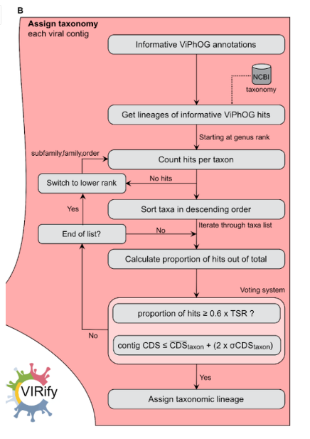

用自己的数据，复现参考文献的流程

参考文献：[***2022-VIRify: An integrated detection, annotation  and taxonomic classification pipeline using  virus-specific protein profile hidden Markov  models***](https://pmc.ncbi.nlm.nih.gov/articles/PMC10491390/)

#### 流程步骤

- 预测ORF (`prodigal`, `-p meta`) 实际输入uvigs and votus

- 使用hmmscan将蛋白比对到hmm数据库( `--noali` `--cut_ga` `-Z ${hmm_size}`)

- **three viral databases**：the [Virus-Host DB](https://www.mdpi.com/1999-4915/8/3/66) ([downloaded in May 2021](https://www.genome.jp/ftp/db/virushostdb/old/release205/)), *crAss-like* phage proteins from [Guerin's study](https://www.cell.com/cell-host-microbe/fulltext/S1931-3128(18)30524-9)（[或者](https://www.nature.com/articles/s41467-021-21350-w)）, and the protein catalogue from [Benler's study](https://www.cell.com/cell-host-microbe/fulltext/S1931-3128(18)30524-9?_returnURL=https%3A%2F%2Flinkinghub.elsevier.com%2Fretrieve%2Fpii%2FS1931312818305249%3Fshowall%3Dtrue)

- 内置逻辑进行注释(如图)

  

#### 注意

- **VIRify有序列名的bug, 需要对输入文件重命名**

```shell
# -m 原名和重命名的映射文件
# -o 重命名后的序列文件
rename.py ${votus} -m ${mapping} -o ${renamed_fasta}

cut -f 1 ${mapping} > ${original_name}
```

- **使用重命名后的序列文件输入VIRify**

```shell
# --viphog_version 使用的hmm数据库版本 v3
# --meta_version 使用的分类信息版本 v4
    nextflow run ${virify} \
        --fasta  ${renamed_fasta} \
        --output  ${virify_dir} \
        --viphog_version ${viphog_version} \
        --meta_version ${meta_version} \
        --databases ${db_dir} \
        --onlyannotate true \
        --length 0 \
        --publish_all
        # > ${virify_log}/${sample}.log 2>&1
    
    # 提取分类表
    mv ${virify_dir}/${sample}_renamed/06-taxonomy/*_taxonomy.tsv ${taxonomy}
```

- **VIRify输出的分类注释表,恢复序列名**

```shell
# 按第一列排序分类表
    head -n 1 ${taxonomy} > ${virify_dir}/tmp
    tail -n +2 ${taxonomy} | sort -t$'\t' -k1,1V >> ${virify_dir}/tmp

    # 使用 original_name 替换 taxonomy 的第一列
    cut -f 2- ${virify_dir}/tmp | paste ${original_name} - > ${final_taxonomy}

    # 删除临时文件
    rm ${virify_dir}/tmp
```

#### 运行此流程

`bash pipeline.sh`

`pipeline.smk` 有时不能运行

#### 输出示例

| original_name                              | superkingdom | kingdom        | phylum      | subphylum | class          | order | suborder | family         | subfamily       | genus |
| ------------------------------------------ | ------------ | -------------- | ----------- | --------- | -------------- | ----- | -------- | -------------- | --------------- | ----- |
| H_O_contig_551\|\|full_1 15253-43298/43298 | Viruses      | Heunggongvirae | Uroviricota |           | Caudoviricetes |       |          |                | Arquatrovirinae |       |
| H_O_contig_705\|\|full_1 1-29509/37319     | Viruses      | Heunggongvirae | Uroviricota |           | Caudoviricetes |       |          |                | Arquatrovirinae |       |
| H_O_contig_988\|\|full_1 18036-29538/29538 | Viruses      | Heunggongvirae | Uroviricota |           | Caudoviricetes |       |          | Salasmaviridae | Picovirinae     |       |